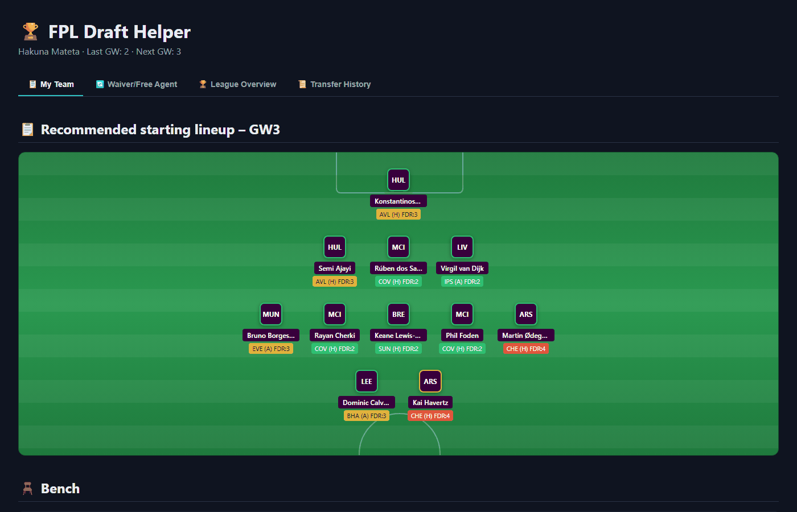

# FPL Draft Helper



A small tool for Fantasy Premier League **Draft** leagues. Pulls your team, free agents, and
league data from `draft.premierleague.com`, and gives recommendations for your starting lineup,
waiver/free agent targets, transfers, and trades.

Available as:
- **CLI** (`main.py`) – tables printed straight to the terminal
- **Website** (`app.py`) – a Flask app you open in your browser

## Setup

1. Create a virtual environment and install dependencies:

   ```bash
   python -m venv .venv
   .venv\Scripts\activate      # Windows
   pip install -r requirements.txt
   ```

2. Copy `.env.example` to `.env`:

   ```bash
   copy .env.example .env
   ```

3. Fill in the values in `.env`:

   - **`PL_COOKIE_HEADER`** – the full `Cookie` header from a logged-in request to
     `draft.premierleague.com` (also works for Google/SSO logins):
     1. Log in at [draft.premierleague.com](https://draft.premierleague.com)
     2. Open DevTools (F12) → the **Network** tab
     3. Reload the page, find a request to `api/game` or `api/element-status`
     4. Under **Request Headers**, copy the entire value of `Cookie`
   - **`PL_ENTRY_ID`** – your team ID, visible in the cookie as `activeEntry`, or in the URL on
     the "My Team" page.

## Running the app

**CLI:**

```bash
python main.py
```

**Website:**

```bash
python app.py
```

Then open [http://127.0.0.1:5000](http://127.0.0.1:5000) in your browser.

## What the tool shows

- Recommended starting lineup and bench for the next gameweek, based on form, fixture difficulty
  (FDR), and player availability
- Free agents worth picking up
- Suggested transfers between your team and free agents
- League overview with points and squads for every manager in the league
- Waiver/transfer history and proposed trades between managers
- Trade opportunities based on what other managers own
- Waiver timing – your priority and the risk of being outbid on targets you're interested in
- A notice when a player has changed clubs since the last run (this also catches moves within
  the Premier League, which the FPL API doesn't flag directly)

## Notes

- `PL_COOKIE_HEADER` expires periodically – grab a fresh one from DevTools if you start getting
  login errors.
- `team_change_cache.json` is a local cache the tool uses to detect club changes between runs.
  It's ignored by git.
