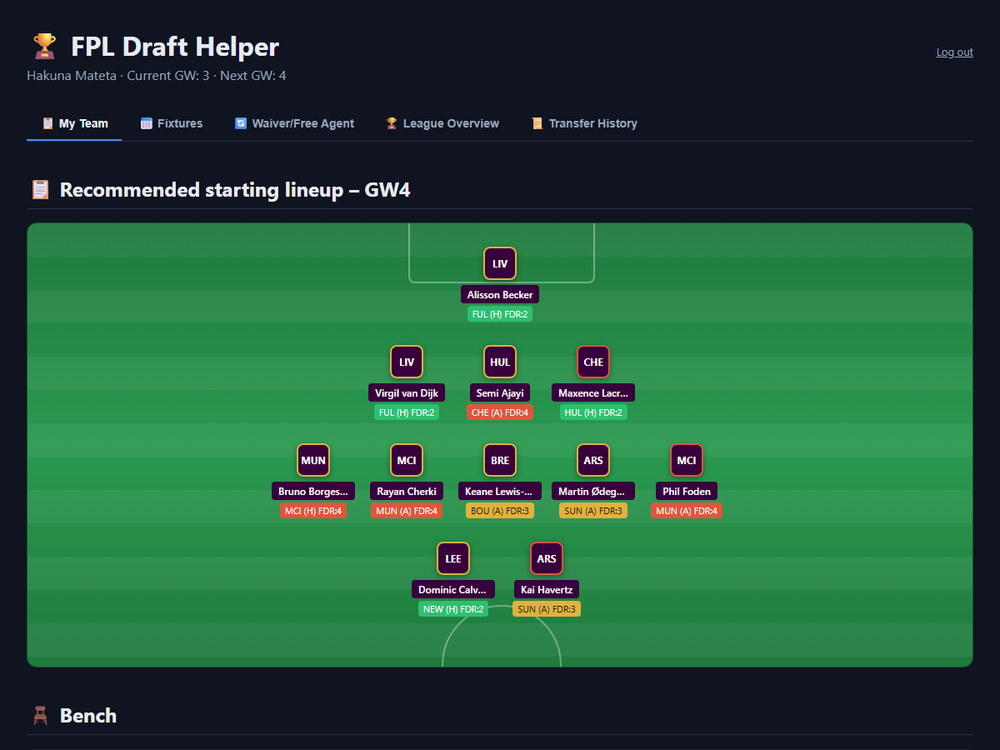
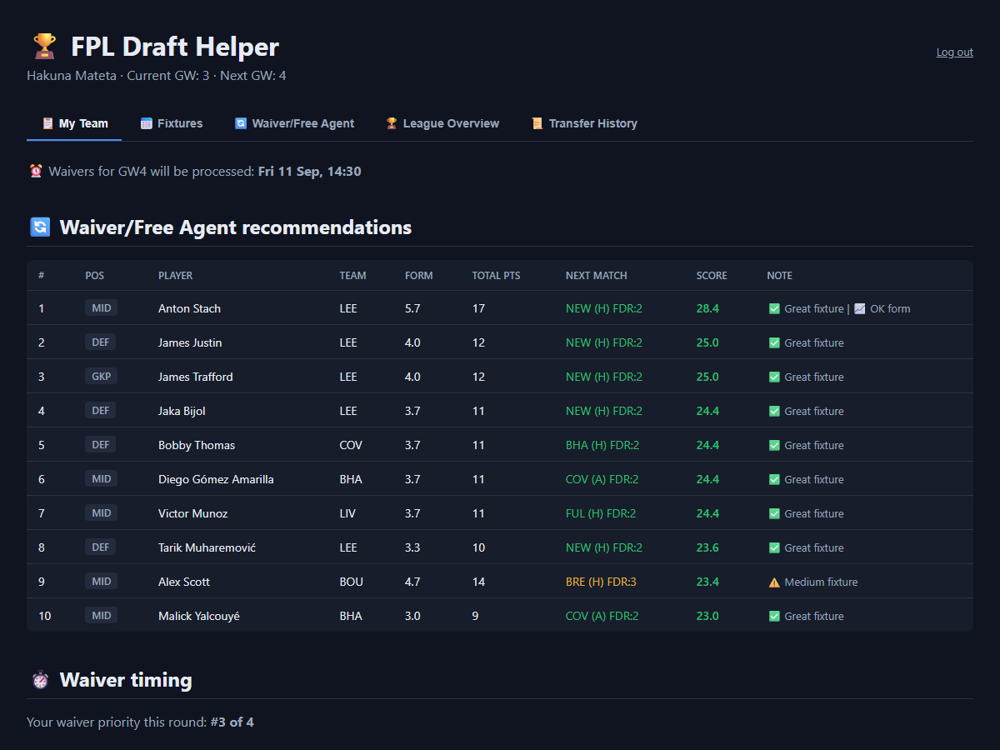

# FPL Draft Helper




A small tool for Fantasy Premier League **Draft** leagues. Pulls your team, free agents, and
league data from `draft.premierleague.com`, and gives recommendations for your starting lineup,
waiver/free agent targets, transfers, and trades.

**Live:** [fpl-draft-helper.vercel.app](https://fpl-draft-helper.vercel.app) (password-protected —
only accessible to me)

## What the tool shows

- Recommended starting lineup and bench for the next gameweek, based on form, fixture difficulty
  (FDR), and player availability
- The current/next gameweek's fixtures involving your players, with kickoff times
- Free agents worth picking up, and suggested transfers between your team and free agents
- League overview with points and squads (shown as a formation) for every manager in the league
- Waiver/transfer history and proposed trades between managers
- Trade opportunities based on what other managers own
- Waiver timing – your priority and the risk of being outbid on targets you're interested in
- A notice when a player has changed clubs since the last run (this also catches moves within
  the Premier League, which the FPL API doesn't flag directly)

Available as a **CLI** (`main.py`, tables printed to the terminal) or a **website** (`app.py`,
what's deployed above).

## Local development

```bash
python -m venv .venv
.venv\Scripts\activate
pip install -r requirements.txt
copy .env.example .env      # then fill in PL_COOKIE_HEADER, PL_ENTRY_ID, APP_PASSWORD, SECRET_KEY

python main.py               # CLI
python app.py                # website → http://127.0.0.1:5000
```

`PL_COOKIE_HEADER`: log in at [draft.premierleague.com](https://draft.premierleague.com), open
DevTools → Network, reload, and copy the `Cookie` header from a request to `api/game`.
`PL_ENTRY_ID`: your team ID (the `activeEntry` cookie value, or in the "My Team" URL).
`SECRET_KEY`: any random string, e.g. `python -c "import secrets; print(secrets.token_hex(32))"`.

If Windows blocks `.venv\Scripts\python.exe` from running (a Smart App Control / app-control
policy), use `.\run.ps1` / `.\run.ps1 app` instead.

## Deploying (Vercel)

The website deploys to [Vercel](https://vercel.com) using `vercel.json` (Flask via
`@vercel/python`). Import the repo in Vercel, add the same four env vars from `.env` under
**Settings → Environment Variables**, and deploy.

Two things don't fully carry over to a serverless deployment: **club-change detection**
(`team_change_cache.json`) needs state to persist between runs, which Vercel's filesystem doesn't
guarantee outside a request — it just quietly stops detecting changes. And the **Hobby plan's
function timeout** can be tight since the app makes several sequential FPL API requests (player
history fetches run in parallel to help).

## Notes

- `PL_COOKIE_HEADER` expires periodically – grab a fresh one from DevTools if you start getting
  login errors.
- `team_change_cache.json` is a local cache the tool uses to detect club changes between runs.
  It's ignored by git.
